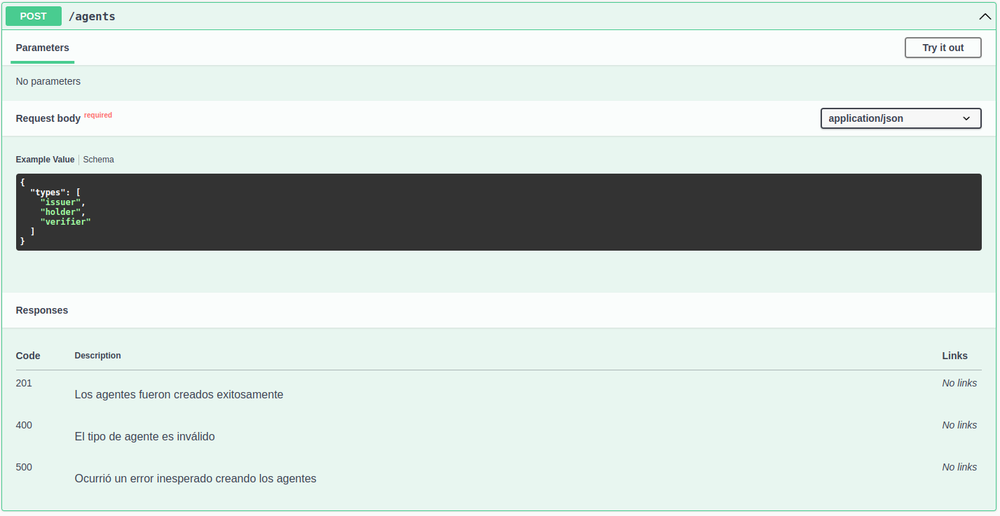
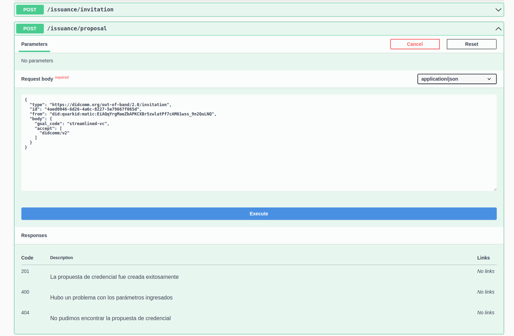
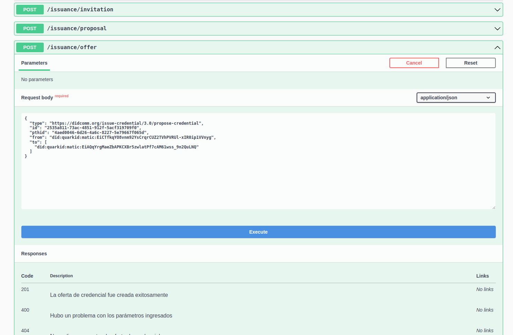
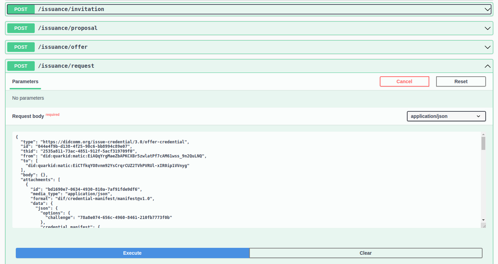
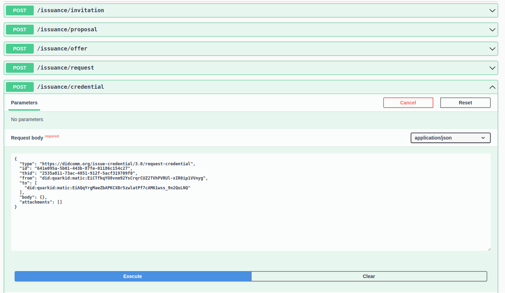
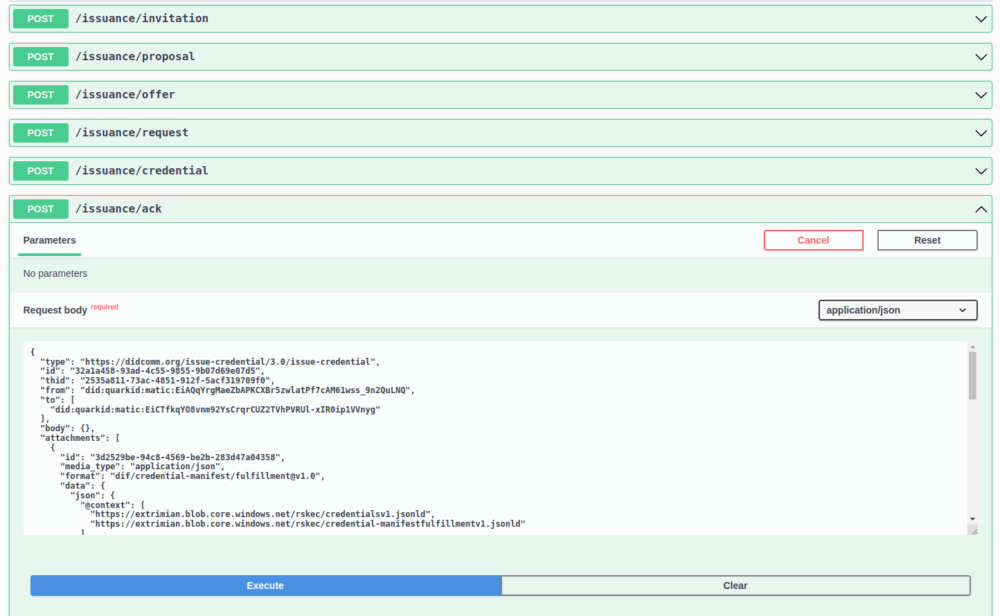

# WACI Demo

## Descripción
Este repo expone una demonstración interactiva del intercambio [Wallet And Credential Interaction (WACI)](https://identity.foundation/waci-didcomm/) entre dos Agentes de Extrimian para mostrar el funcionamiento interno de nuestra solución SSI. El objetivo es proveer una API simple donde crear agentes y emitir credenciales de prueba, viendo el resultado de cada paso intermedio en la comunicación entre los agentes SSI.

## Requisitos
- Node.js >= v14.21.3
- Yarn

## Instalación
Simplemente correr el comando `yarn install` para instalar las dependencias del proyecto.

```bash
yarn install
```
## Configuración
La aplicación se configura con valores por defecto y mediante variables de entorno. Estas variables permiten cambiar configuraciones como:
- Puerto de la aplicación: `PORT`
- DID Method usado para crear los agentes: `DID_METHOD`
- URL del Decentralized Web Node (DWN): `DWN_URL`
- URL del servicio de anchor Modena: `MODENA_URL`

Para obtener enlaces a servicios de DWN y Modena personalizados utilizar el [portal de SaaS de Extrimian](https://idportal.extrimian.com/).

> Nota: Consultar en el archivo .env.example para ver los valores por defecto.

## Correr la aplicación
Basta con correr el comand `yarn start` para correr la aplicación en modo desarrollo. La aplicación se ejecutará en el puerto 3000 por defecto. 

```bash
yarn start
```
## Uso
La aplicación expone una API REST documentada con Swagger UI en la ruta `/api`. Esta API permite crear agentes y emitir credenciales.

### Crear un agente
En primer lugar, se deben crear los agentes. Estos pueden ser del tipo `issuer`, `holder` o `verifier`.



Cabe resaltar que la respuesta que recibimos cuando creamos o obtenemos un agente es el [DID Document](https://www.w3.org/TR/did-core/#did-resolution) del agente, que contiene la información que describe al sujeto identificado por el DID y los mecanismos que éste puede usar para provar su asociación al DID, como claves criptográficas públicas.

### Emisión de credenciales
Seguimos el flujo de emisión de credenciales definido en el estándar [WACI](https://identity.foundation/waci-didcomm/#issuance-2). Para eso, vamos a necesitar los agentes `holder` e `issuer` creados en el paso anterior.

#### **Crear invitación**
Primero debemos crear la solicitud de emisión de credencial. Para eso, hay que copiar el DID del `issuer` creado en el paso anterior (en el campo `id`) y pegarlo en el campo `senderDid` de la creación de invitación.

Este paso representa la obtención de la invitación de emisión de credencial por parte del `issuer` (como generar un código QR). La invitación será recibida por el `holder` mediante un intercambio `Out Of Band (OOB)` como escannear un QR, por ejemplo. Al acceder al link obtenido, el `holder` va a aceptar la invitación y comenzar el proceso de emisión de credencial propiamente dicho en el siguiente paso.

[create-invitation-final.webm](https://user-images.githubusercontent.com/58373778/236511172-819d1756-d2bf-4f47-a7c1-e82c6e55429e.webm)

> Nota: En los siguientes pasos lo único que hay que hacer es copiar la respuesta del paso anterior y pegarla en el body del siguiente endpoint.

#### **Crear propuesta de credencial**
Luego, copiamos la invitación obtenida en el paso anterior y la pegamos en el cuerpo del siguiente endpoint: `POST /issuance/proposal`. 

Este paso representa la creación de la propuesta de emisión de credencial por parte del `holder`, que será enviado al `issuer` en el siguiente paso. 

 

#### **Enviar la propuesta y conseguir la oferta de credencial**
A continuación, copiamos la propuesta creada en el paso anterior y la pegamos en el cuerpo del siguiente endpoint: `POST /issuance/offer`. Esto nos devolverá la oferta de credencial que el `issuer` le hace al `holder` en base a la propuesta enviada. El `holder` puede decidir si proseguir con la emisión, aceptando o rechazando la oferta.

Este paso representa el envío de la propuesta de emisión de credencial por parte del `holder` y la creación de la oferta de credencial por parte del `issuer`. Cabe notar que la credencial ofrecida contiene todos los datos que el `issuer` quiere emitir, pero no está firmada.



#### **Crear la solicitud de credencial**
Ahora debemos copiar la oferta de credencial obtenida en el paso anterior y pegarla en el body del siguiente endpoint: `POST /issuance/request`. Esto nos devolverá la solicitud de credencial que el `holder` le enviará al `issuer` en base a la oferta creada en el paso anterior. 

Este paso representa la verificación por parte del `holder` de que todo está en orden en la oferta de credencial y que quiere proceder con la emisión.



#### **Enviar la solicitud y conseguir la credencial firmada**
A continuación, copiamos la solicitud de credencial del paso anterior y la pegamos en el body del siguiente endpoint: `POST /issuance/credential`. Esto nos devolverá la credencial firmada que el `issuer` le emite al `holder` en base a la solicitud creada en el paso anterior.

Este paso representa el envío de la solicitud de credencial por parte del `holder` y la emisión de la credencial ya firmada por parte del `issuer`.



#### **Crear el mensaje de acuso de recibo**
Finalmente, copiamos la credencial firmada obtenida en el paso anterior y la pegamos en el cuerpo del siguiente endpoint: `POST /issuance/ack`. Esto nos devolverá el mensaje de acuso de recibo que el `holder` le envía al `issuer` para confirmar que recibió la credencial. 

Este paso representa el fin del intercambio, donde el `holder` tiene la opción de acusar recibo de la credencial emitida por el `issuer`. Cabe resaltar que el `holder` no tiene la obligación de acusar recibo de la credencial, pero es una buena práctica hacerlo.



### Presentación de credenciales
Seguimos el flujo de presentación de credenciales definido en el estándar [WACI](https://identity.foundation/waci-didcomm/#presentation-2). Para eso, vamos a necesitar los agentes `holder` y `verifier` previamente creados.

> El procedimiento es análogo al de emisión de credenciales, con la diferencia de que en este caso el `holder` es quien inicia el intercambio.
#### **Crear invitación**
Primero debemos crear la solicitud de presentación de credencial. Para eso, hay que copiar el DID del `verifier` creado en el paso anterior (en el campo `id`) y pegarlo en el campo `senderDid` de la creación de invitación.

Este paso es análogo a la creación de invitación en la emisión de la credencial: el `verifier` está creando la invitación para enviarla al `holder` y que éste pueda presentarle la credencial. 


[create-presentation-invitation](https://github.com/extrimian/waci-demo/assets/58373778/36a03f83-2d2d-4122-bd55-0f16149d4c1c)


#### **Crear propuesta de presentación**
Luego, copiamos la invitación obtenida en el paso anterior y la pegamos en el cuerpo del siguiente endpoint: `POST /presentation/proposal`.

Este paso representa la creación de la propuesta de presentación de credencial por parte del `holder`, que será enviada al `verifier` en el siguiente paso.

#### **Enviar la propuesta y conseguir la solicitud de presentación**
A continuación, copiamos la propuesta creada en el paso anterior y la pegamos en el cuerpo del siguiente endpoint: `POST /presentation/request`. Esto nos devolverá la solicitud de presentación que el `verifier` le hace al `holder` en base a la propuesta enviada. El `holder` puede decidir si proseguir con la presentación, aceptando o rechazando la solicitud.

Este paso representa el envío de la propuesta de presentación de credencial por parte del `holder` y la creación de la solicitud de presentación por parte del `verifier`.
#### **Crear la presentación de la prueba**
Ahora debemos copiar la solicitud de presentación obtenida en el paso anterior y pegarla en el body del siguiente endpoint: `POST /presentation/proof`. Esto nos devolverá la presentación de credencial que el `holder` le enviará al `verifier` en base a la solicitud creada en el paso anterior.

Este paso representa la verificación por parte del `holder` de que todo está en orden en la solicitud de presentación y que quiere proceder con la presentación.

#### **Enviar la presentación y conseguir el acuso de recibo**
A continuación, copiamos la presentación de credencial del paso anterior y la pegamos en el body del siguiente endpoint: `POST /presentation/ack`. Esto nos devolverá el acuso de recibo que el `verifier` le envía al `holder` para confirmar que recibió la presentación de la credencial.

Este paso representa el fin del intercambio, donde el `verifier` tiene la opción de acusar recibo de la presentación de la credencial realizada por el `holder`. Cabe resaltar que el `verifier` no tiene la obligación de acusar recibo de la presentación, pero es una buena práctica hacerlo.

### Logs y almacenamiento
La aplicación guarda los logs de los agentes y los mensajes enviados a los DWN en la carpeta `storage` por defecto. Ahí se puede hacer un seguimiento de los intercambios WACI que realizan los agentes, ver los mensajes cifrados enviados al DWN y acceder al almacenamiento privado de cada uno de los agentes, donde se almacenan sus claves.